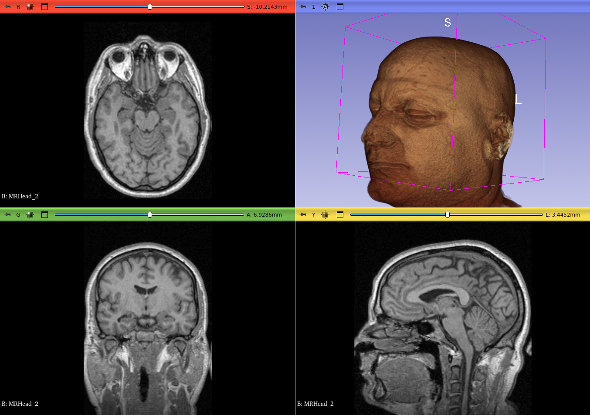

## MorphoDepot Repository
Repository for segmentation of a specimen scan.  See [this JSON file](MorphoDepotAccession.json) for specimen details.
* Species: Pteronitella humanensis
* Modality: MRI
* Contrast: No
* Dimensions: (256, 256, 130)
* Spacing (mm): (1.0, 1.0, 1.2999954223632812)

## Screenshots

